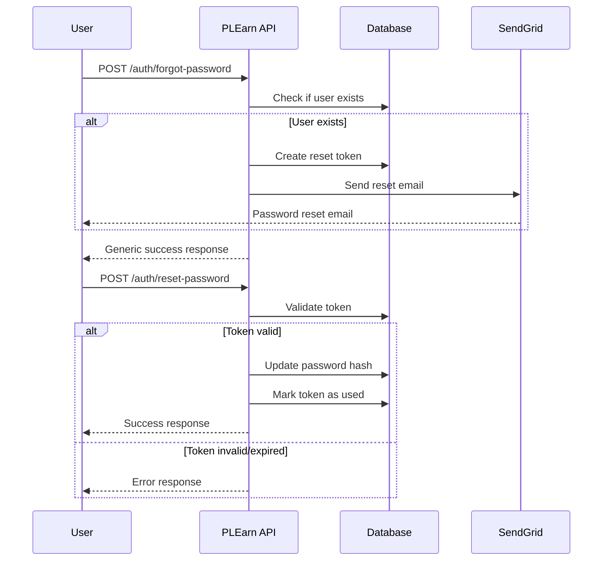

# Password Reset Feature Documentation

## Overview

The PLEarn backend now supports email-based password reset functionality, allowing users to securely reset their passwords when they forget them. This feature includes robust security measures, rate limiting, and comprehensive email notification.

## Security Features

### Token-Based Reset System
- **Unique Tokens**: Each reset request generates a unique UUID token
- **Time-Limited**: Tokens expire after 1 hour
- **Single-Use**: Tokens are invalidated after successful password reset
- **Secure Storage**: Tokens are stored in a dedicated database table with proper relationships

### Rate Limiting
- **API Level**: Throttling applied to prevent abuse
  - `/auth/forgot-password`: 3 requests per minute per IP
  - `/auth/reset-password`: 5 requests per minute per IP
- **User Level**: Prevents multiple active tokens per user
- **Auto-cleanup**: Expired tokens are automatically cleaned up

### Privacy Protection
- **Email Enumeration Prevention**: Same response for existing and non-existing emails
- **Secure Email Templates**: Professional HTML templates with clear instructions
- **Error Handling**: Generic error messages to prevent information disclosure

## API Endpoints

### Request Password Reset

```http
POST /auth/forgot-password
Content-Type: application/json

{
  "email": "user@example.com"
}
```

**Response** (200 OK):
```json
{
  "message": "If an account with this email exists, a password reset link has been sent."
}
```

**Validation Rules**:
- `email`: Must be a valid email format
- Rate limited to 3 requests per minute per IP

### Reset Password

```http
POST /auth/reset-password
Content-Type: application/json

{
  "token": "uuid-token-from-email",
  "newPassword": "newSecurePassword123"
}
```

**Response** (200 OK):
```json
{
  "message": "Password has been successfully reset."
}
```

**Validation Rules**:
- `token`: Must be a valid, unexpired, unused reset token
- `newPassword`: Minimum 8 characters
- Rate limited to 5 requests per minute per IP

**Error Responses**:
- `400 Bad Request`: Invalid/expired token, validation errors, rate limit exceeded
- `500 Internal Server Error`: Email service failures

## Email Configuration

### Required Environment Variables

```bash
# SendGrid Configuration
SENDGRID_API_KEY=your_sendgrid_api_key_here
FROM_EMAIL=noreply@plearn.com
FROM_NAME=PLEarn Platform

# Frontend URL (for reset links)
FRONTEND_URL=http://localhost:3000
```

### Email Template Features

- **Professional HTML Design**: Clean, responsive email template
- **Clear Call-to-Action**: Prominent reset button
- **Security Information**: Clear expiration notice (1 hour)
- **Fallback URL**: Plain text URL for accessibility
- **Branding**: Consistent with PLEarn platform

## Database Schema

### PasswordResetToken Entity

```sql
CREATE TABLE password_reset_tokens (
    id UUID PRIMARY KEY DEFAULT gen_random_uuid(),
    token VARCHAR NOT NULL UNIQUE,
    user_id UUID NOT NULL REFERENCES users(id) ON DELETE CASCADE,
    expires_at TIMESTAMP NOT NULL,
    used BOOLEAN DEFAULT FALSE,
    created_at TIMESTAMP DEFAULT CURRENT_TIMESTAMP
);

-- Indexes for performance
CREATE INDEX idx_password_reset_tokens_token ON password_reset_tokens(token);
CREATE INDEX idx_password_reset_tokens_user_id ON password_reset_tokens(user_id);
CREATE INDEX idx_password_reset_tokens_expires_at ON password_reset_tokens(expires_at);
```

## Implementation Architecture

### Service Layer

1. **EmailService**: Handles SendGrid integration and email templates
2. **PasswordResetService**: Core business logic for token management
3. **AuthService**: Existing service extended for password operations

### Flow Diagram



## Security Considerations

### Token Security
- **Cryptographically Secure**: Uses UUID v4 for token generation
- **Database Protection**: Foreign key constraints and cascade deletes
- **Timing Attacks**: Consistent response times for existing/non-existing users

### Email Security
- **No Sensitive Data**: Emails don't contain user information beyond email
- **HTTPS Links**: All reset links use HTTPS in production
- **Clear Expiration**: Users understand token lifetime limitations

### Rate Limiting Strategy
- **Multiple Layers**: API throttling + application-level checks
- **IP-Based**: Prevents automated attacks
- **User-Based**: Prevents token flooding for single users

## Testing

### Unit Tests
- **PasswordResetService**: Complete coverage of business logic
- **AuthController**: API endpoint behavior
- **EmailService**: Template generation and SendGrid integration

### Integration Tests
- **End-to-End Flow**: Complete password reset process
- **Rate Limiting**: Throttling behavior verification
- **Token Expiration**: Time-based validation
- **Database Consistency**: Proper cleanup and relationships

### Test Command
```bash
# Run all tests
npm test

# Run password reset specific tests
npm test -- --testNamePattern="password.*reset"

# Run E2E tests
npm run test:e2e
```

## Monitoring and Logging

### Application Logs
- **Token Generation**: Logged with user email (not token value)
- **Email Sending**: Success/failure with error details
- **Password Resets**: Successful resets logged for audit

### Metrics to Monitor
- **Reset Request Rate**: Unusual spikes may indicate attacks
- **Email Delivery Rate**: Monitor SendGrid delivery success
- **Token Usage Rate**: How many tokens are actually used
- **Error Rates**: Failed reset attempts and reasons

## Deployment Notes

### SendGrid Setup
1. Create SendGrid account and API key
2. Verify sender email domain
3. Configure environment variables
4. Test email delivery in staging

### Production Considerations
- **Rate Limiting**: May need adjustment based on user base
- **Email Templates**: Consider localization for international users
- **Token Cleanup**: Consider scheduled cleanup of old tokens
- **Monitoring**: Set up alerts for high error rates

## Future Enhancements

- **Multi-language Support**: Localized email templates
- **SMS Reset**: Alternative to email-based reset
- **Security Questions**: Additional verification layer
- **Admin Controls**: Dashboard for monitoring reset activities
- **Advanced Rate Limiting**: Per-user sliding windows
